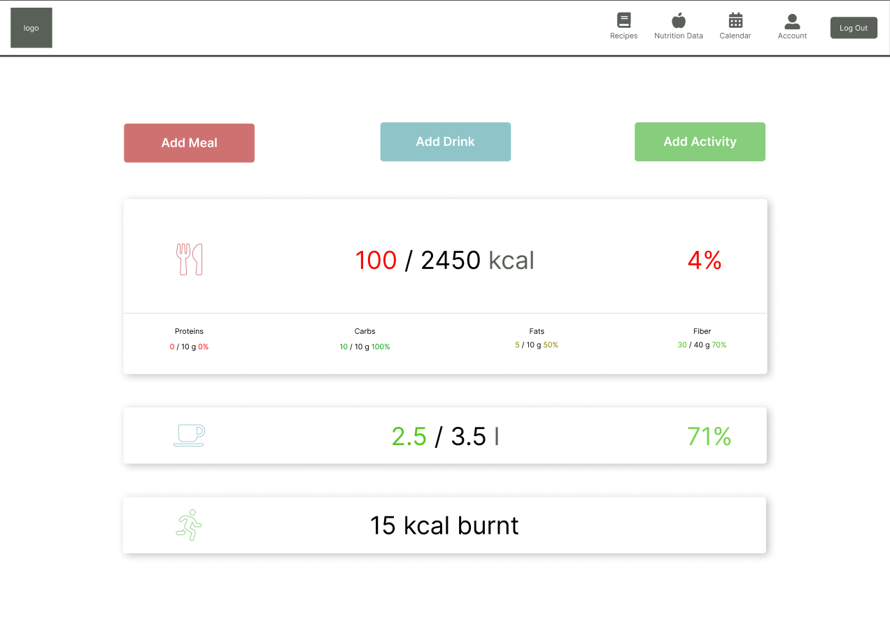
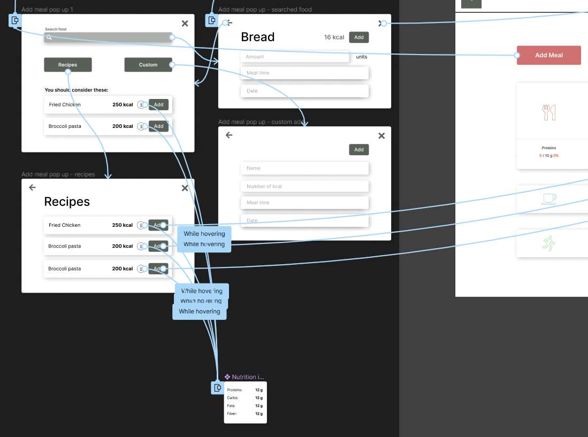
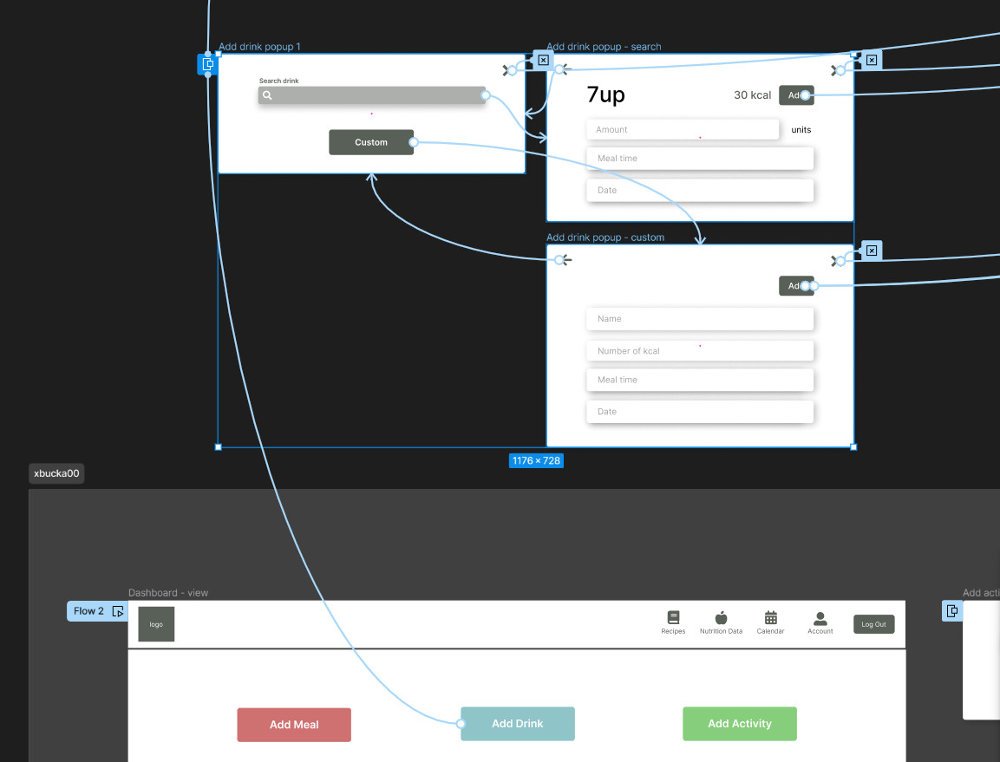
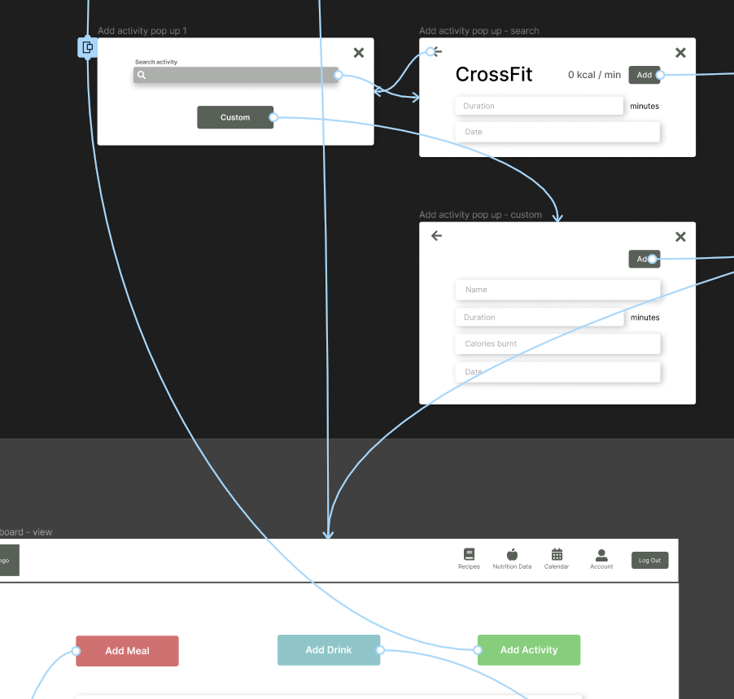

# xbucka00 - Maketa aplikácie

Moja maketa rieši časti aplikácie špecifikované v časti [Rozdelenie práce](#rozdelenie-práce). Jedná sa predovšetkým o dashboard stránku s výpisom denného súhrnu. Následne som sa venoval zadávaniu údajov týkajúcich sa prijatého jedla, tekutín a fyzickej aktivity.

## Dashboard

Obrázok 1: Dashboard

Táto stránka rieši nasledovné užívateľské potreby:
- Denný súhrn
    - Zobrazenie 3 sekcií: Prijaté kalórie, prijaté množstvo vody, spálené kalórie
- Percentuálny podiel množstva prijatích výživových údajov (bielkoviny, sacharidy, tuky) na dennom cieli
    - V rámci sekcie o prijatých kalóriách sú zobrazené percentuálne podiely prijatých bielkovín, sacharidov, tukov a vlákniny na dennom cieli
V rámci obrazovky dashboardu je v hornej časti prítomná navigácia pre prechod na ostatné časti aplikácie.

Tlačítka:
- *Add Meal* - otvára popup pre pridanie jedla
- *Add Drink* - otvára popup pre pridanie pitného režimu
- *Add Activity* - otvára popup pre pridanie aktivity

## Pridanie jedla

Obrázok 2: Pridanie jedla

Po stlačení tlačítka *Add Meal* sa otvorí popup pre pridanie jedla.
V rámci tohto popupu, a jeho pridružených popupov, sú riešené nasledovné užívateľské potreby:
- Zapisovanie kalórií podľa jedla/potraviny (s množstvom) z databázy a manuálne
    - V rámci popupu je možné vyhľadať jedlo/potravinu z databázy a zadať jeho množstvo
    - Tlačítko *Custom* v popupe *Add Meal* otvára popup pre pridanie jedla s manuálnym zadaním jeho údajov
- Odporúčanie jedál/receptov pre splnenie kalorického cieľa
    - Sekcia *You should consider these* navrhuje užívateľovi recepty pre splnenie denného kalorického cieľa

## Pridanie pitného režimu

Obrázok 2: Pridanie pitného režimu

Po stlačení tlačítka *Add Drink* sa otvorí popup pre pridanie pitného režimu. V rámci tohto popupu, a jeho pridružených popupov, sú riešené nasledovné užívateľské potreby:
- Zadávanie pitného režimu
    - Je možné vyhľadať nápoj z databázy a zadať jeho množstvo alebo stlačením tlačítka *Custom* zadať nápojové údaje manuálne

## Pridanie aktivity

Obrázok 3: Pridanie aktivity

Po stlačení tlačítka *Add Activity* sa otvorí popup pre pridanie aktivity. V rámci tohto popupu, a jeho pridružených popupov, sú riešené nasledovné užívateľské potreby:
- Logovanie aktivít
    - Je možné vyhľadať aktivitu z databázy a zadať jej dĺžku alebo stlačením tlačítka *Custom* zadať údaje o aktivite manuálne